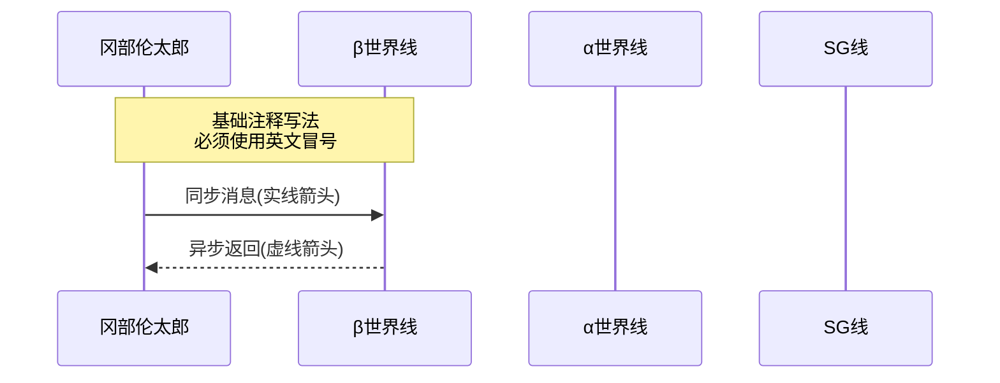
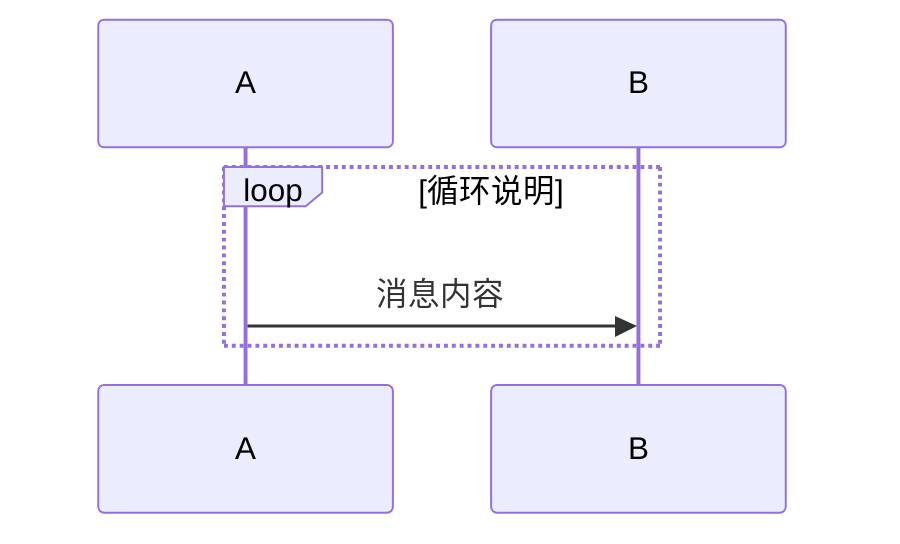
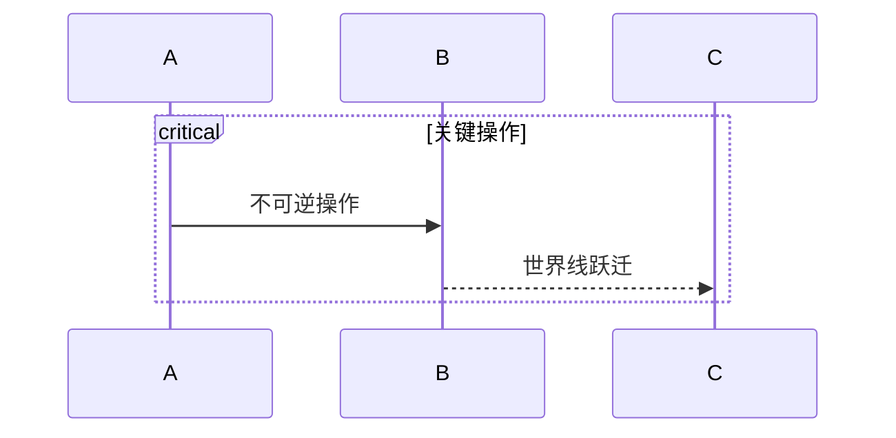
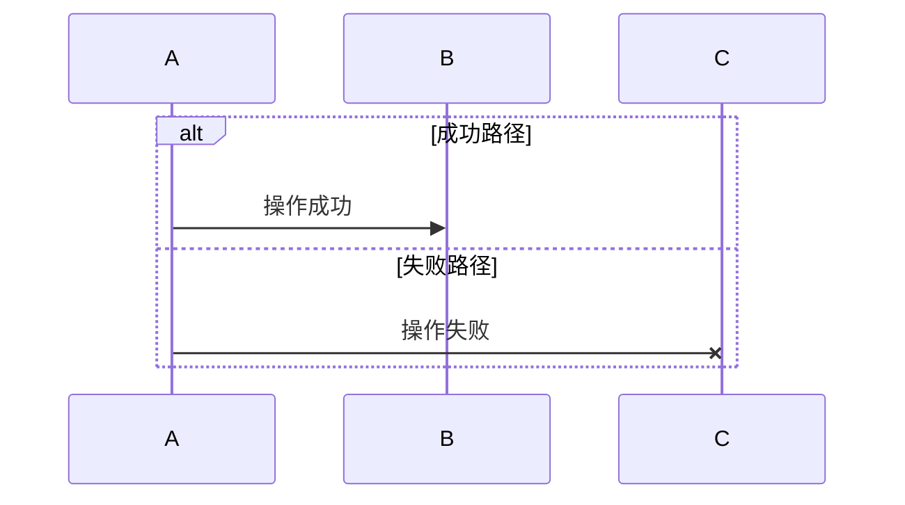
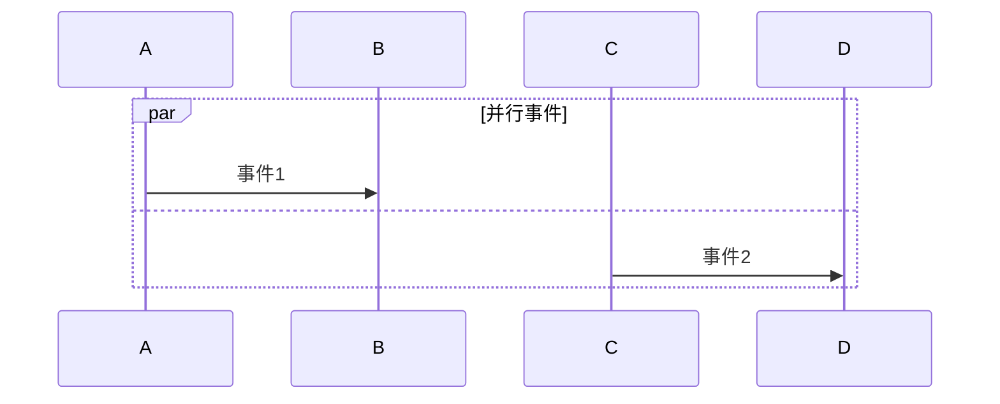
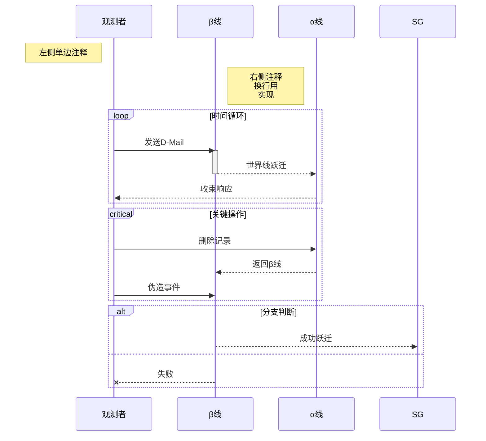
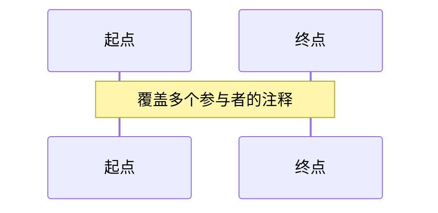
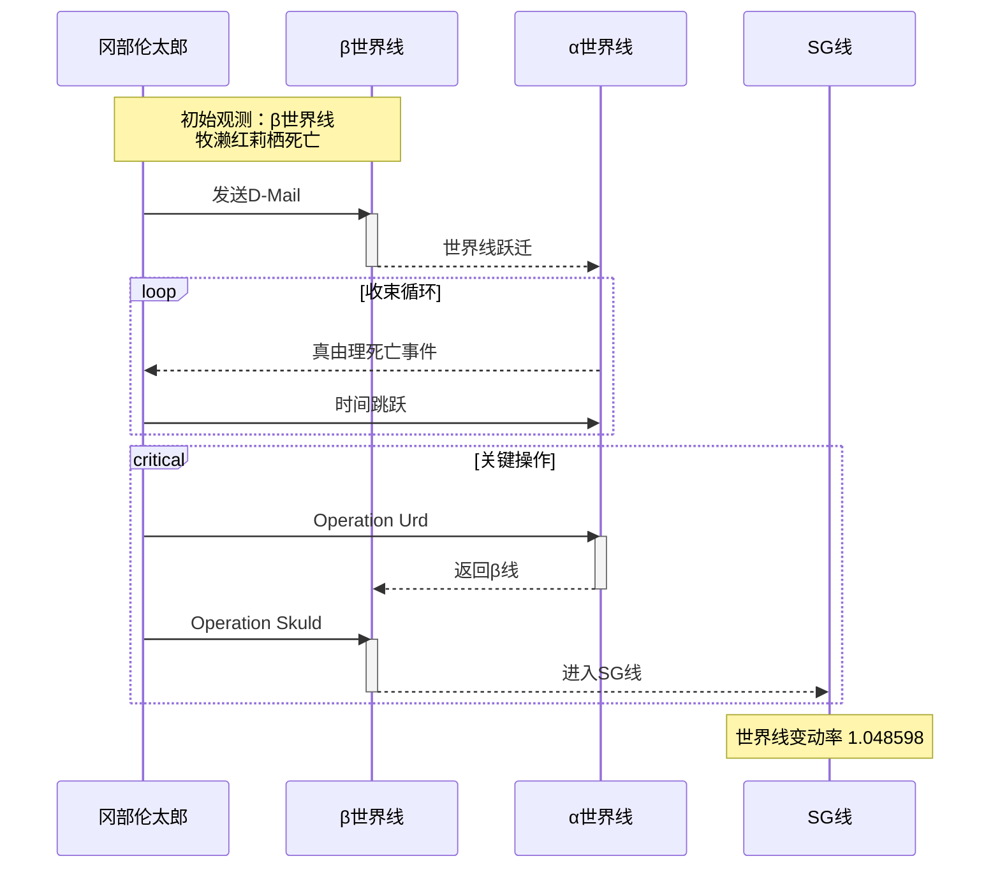

---
### 一、基础语法

1. 循环结构

2. 关键路径

✨3. 分支结构

✨4. 并行结构

---

### 二、可运行的高级功能示例

---

### 三、严格语法规范表，易错点

| 元素类型  | 正确写法                      | 错误写法                |
| ----- | ------------------------- | ------------------- |
| 参与者定义 | `participant A as 名称`     | `participant A: 名称` |
| 注释换行  | `Note over A: 第一行 第二行` | 使用`\n`              |
| 激活区块  | `activate A` 必须配对使用       | 单独使用activate        |
| 箭头符号  | `->>` `-->>` `-x`         | 使用全角箭头→             |
| 颜色定义  | `participant A #FF0000`   | 使用color:red         |
1. 跨参与者注释

---

### 四、已验证的完整案例

---
